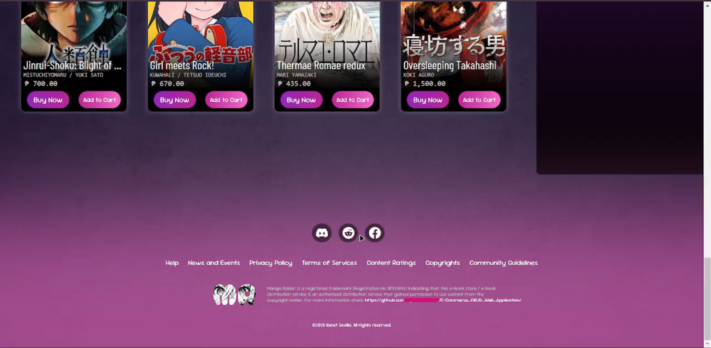
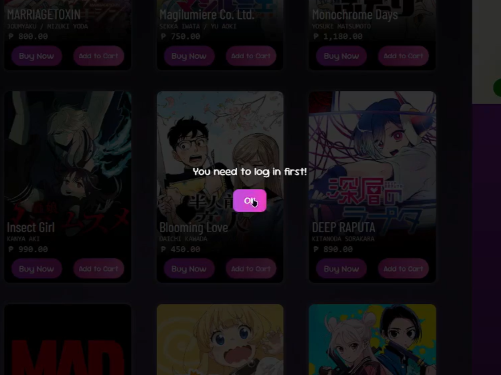
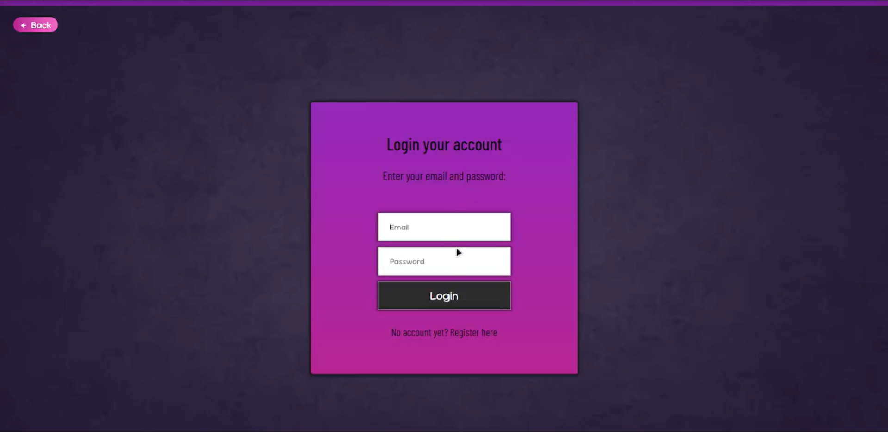
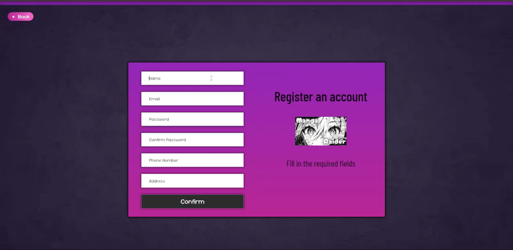
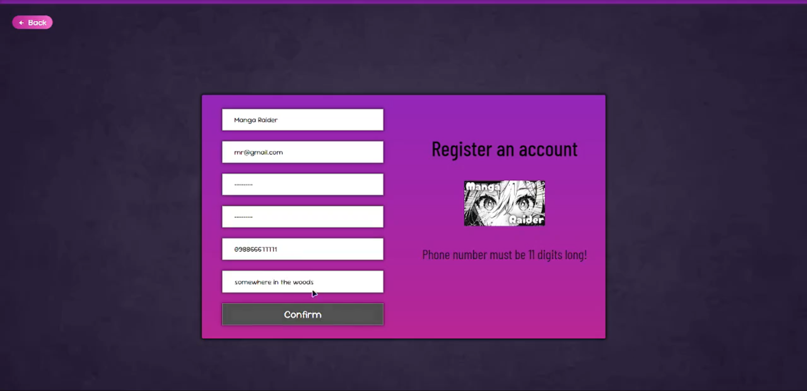
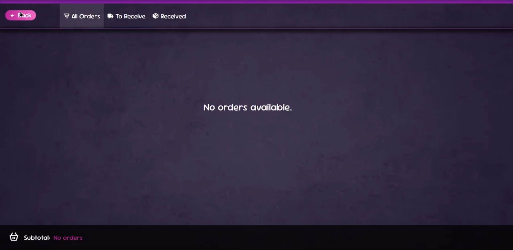
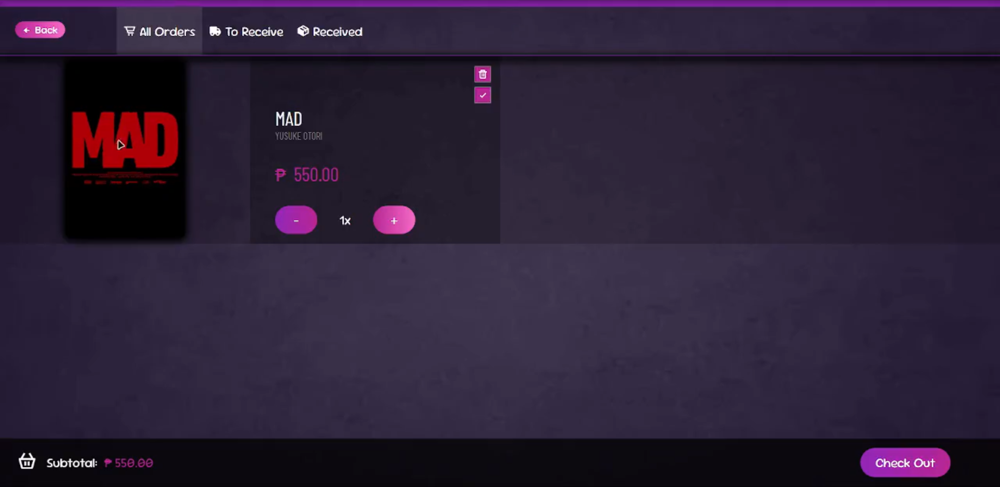
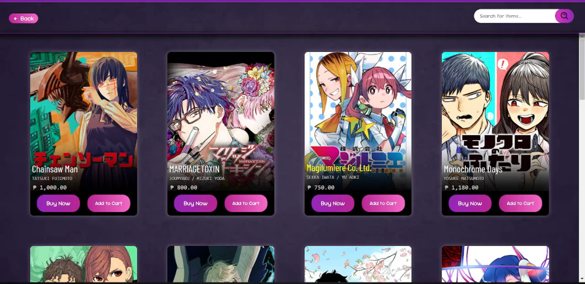
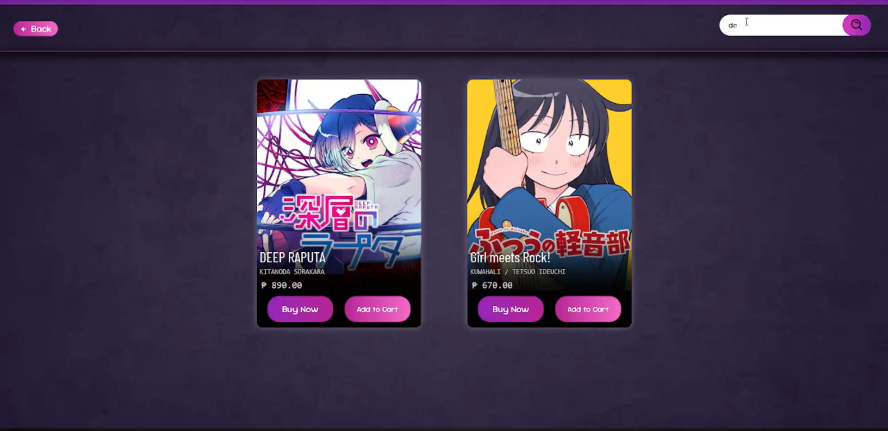

# E-commerce CRUD web app
A full-stack e-commerce simulation. Features a React frontend for the UI and an Express/MySQL backend for handling user data, product inventory, and order management.

> [!IMPORTANT]
> ## Acknowledgements
> This project was heavily inspired by the design of [MangaPlus](https://mangaplus.shueisha.co.jp/).
> 
> Created for educational purposes as part of a college project.

## Features
> Full-Stack Architecture: Combines a React frontend with a Node/Express backend.
> 
> Product Management: Admins can create and manage manga listings (titles, prices, images).
> 
> User Simulation: Functional registration flow that syncs data to both a MySQL database and LocalStorage.
> 
> Client-Side Authentication: Simulates login sessions using LocalStorage for role-based access control (Admin/User).
> 
> Shopping Cart: Custom cart logic allowing users to add items, adjust quantities, and "checkout" (order simulation).

## Technologies Used
> ### Frontend:
> React.js: Component-based UI architecture
> 
> React Router: For Single Page Application (SPA) navigation
> 
> Axios: For making HTTP requests to the backend
> 
> Vite: Build tool for rapid development
> 
> CSS / Boxicons: Custom styling and iconography

> ### Backend:
> Node.js & Express: REST API for handling user registration and product management
> 
> MySQL: Relational database for persistent storage of users and products
> 
> Nodemon: For development server monitoring

## Preview
> 

> 

> 

> 

> 

> 

> 

> 

> 

> 

> 

> 

> 

> 
